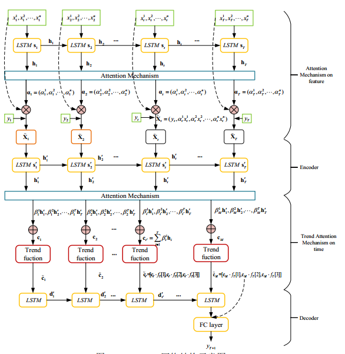

## TALSTM

本项目提出一种新的趋势注意力机制下的LSTM模型预测单只股票价格变化，对每个价值型优质股进行股价预测，从而根据价值型优质股的短期价格变化选择出短期内有可能获得超额收益的股票组合。从理论上看，短期股价预测属于金融时间预测问题。

### 特征构建

股票市场是一个典型的非线性复杂网络系统，股价的波动不仅受到上市公司内在价值的影响，还与宏观经济市场和相关股票的联动作用相关。大量的研究表明，股票之间有明显的相关关系，股票的价格波动会受到相关股票的影响。Chen H等人证明了中国股票市场存在股票之间的相关影响作用并给出了相关网络结构。同时部分学者开始研究股票相关性是否长期存在，Stanley H等人证明股票之间不仅存在长期相关性，且相关股的影响是具有长时记忆性的。
因此本文构造基于TALSTM的短期股价预测模型时，本文考虑股票内生变量和外生变量两类变量。股票内生变量是指与需预测股票直接相关的序列变量，包括需预测股票的历史开盘价序列、历史收盘价序列、历史最高价序列、历史最低价序列和历史交易量序列。股票外生变量指的是对需预测股票产生影响的大盘指数和相关股股价

### TA-LSTM模型的神经网络结构

金融时间序列存在着时变性、非平稳、非正态、高噪音和自相关等金融特性，十分难以准确预测。近年来众多学者将SVM、DT和BPNN等机器学习方法用于解决时间序列预测问题，但是这些方法大都只适用于单时间序列预测模型，不能解决多元时间序列预测问题。随着深度学习的发展，LSTM模型成为多元时间序列最常用的模型，但是也存在着对每个时刻、每个特征都给予相同权重的缺点。为了更加符合股票波动规律，并且考虑历史股价波动先验信息，基于级联模型的思想，本文提出一种新的趋势注意力机制的LSTM模型(TALSTM模型)进行股价预测。TALSTM模型不仅利用注意力机制对不同特征和不同时刻进行重构，同时引入经典的技术分析策略构造股票趋势自适应函数，利用历史先验数据得到股票先验趋势，从而改进注意力机制编码单元，获得新的趋势注意力层。TALSTM模型符合了金融时间序列的长时间记忆性、非线性等特性，又实现了多元时间序列预测中特征筛选和时刻筛选的功能，同时通过引入经典技术分析趋势项使得模型更加稳定、高效。

